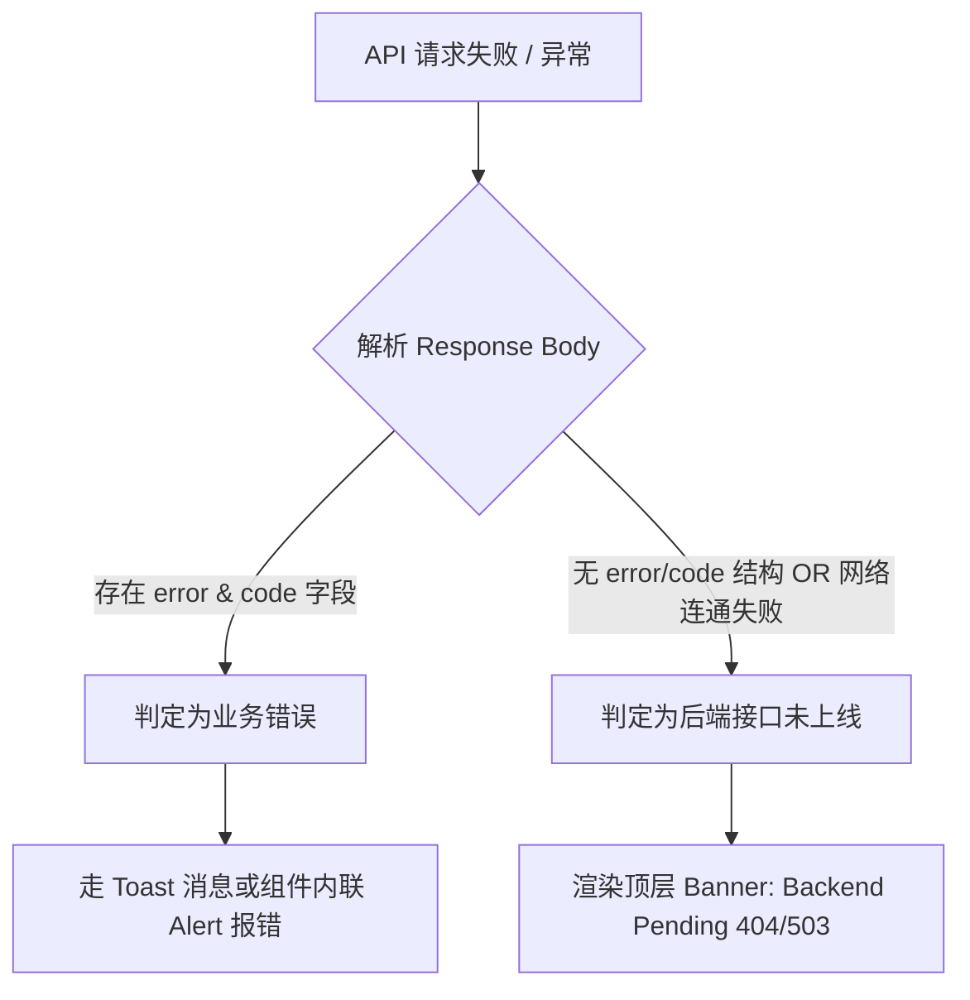

# 施工计划：Per-Agent Tool Drawer 授权与 MCP 凭证管理 (前端实现方案)

> **版本**：v2.1 (完美合并 DeepSeek 审阅意见：单一写入入口 + 404/503 信封判空规则 + 组件拆分)  
> **目标**：在 `ExoCore-Desktop` 的 `chat-core` 模块中实现 MCP 凭证管理与 Drawer 授权功能。  
> **契约依据**：`ReactSheet.md` 第十篇 / `REQ_20260813_Drawer_Access_MCP_Credential_Management.md`  
> **状态**：`[已就绪 / 待 Alicia 最终批准]`

---

## 1. 核心架构与设计原则

1. **单项数据流与单一写入入口 (Single Source of Truth)**
   - **Tab 1** (`McpCredentialPoolTab.jsx`)：负责 **MCP 凭证 CRUD** 与 **Server 公共凭证绑定**。凭证行中的 "Assigned Agents" 保持为**纯派生只读标签**，展示当前被哪些 Agent 引用。
   - **Tab 2** (`McpAgentAccessTab.jsx`)：为 **Agent 绑定与 Visitor 授权的唯一写入入口**。集中处理 Preset Drawer Visitor 勾选 (`enabled`) 和 Preset MCP 凭证模式/Alias 选择。彻底消除双写入口导致的状态不一致与领域模型冲突。
2. **安全隔离 (Write-Only Secret)**
   - 凭证密钥 (`credential_value`) 为纯写文本，前端任何视图与 API Response 均不接收/不保存明文。
   - Modal 提交后显式置空 React State，禁止写入 `localStorage`/`sessionStorage`、控制台日志或 Toast。
3. **精准 404/503 信封判定与禁 Mock 规则**
   - 绝不使用 KeyManagePanel 的 catch-mock-fallback 模式。
   - **判定规则**：捕获 HTTP 404/503 或网络失败时，检测 Response Body：
     - 若解析出合法业务信封 `{ error: "...", code: "..." }`（例如 `drawer_unavailable`, `preset_not_found`），作为**业务错误**走 Toast 或内联 Alert 展示；
     - 若无法解析出业务信封（如 Django URL 404 或网络断连），才渲染 **`Backend Pending (后端待施工)`** Banner。
4. **组件拆分架构**
   - 将组件剥离并放入 `packages/chat-core/src/components/settings/mcp/` 目录，避免单文件臃肿。

---

## 2. API Wrapper 扩展设计 (`packages/shared/src/endpoints/mcp.js`)

新建 [`packages/shared/src/endpoints/mcp.js`](file:///D:/Alicia/ExoCore_Project/ExoCore-Desktop/packages/shared/src/endpoints/mcp.js) 并导出为 `mcpApi`：

```javascript
import { apiFetch } from '../api';

// Drawer Catalog & Preset Visitor
export function listDrawers() { return apiFetch('/api/agents/drawers/', { method: 'GET' }); }
export function getPresetDrawers(presetId) { return apiFetch(`/api/agents/presets/${presetId}/drawers/`, { method: 'GET' }); }
export function updatePresetDrawer(presetId, drawerName, enabled) {
  return apiFetch(`/api/agents/presets/${presetId}/drawers/${encodeURIComponent(drawerName)}/`, {
    method: 'PUT', body: { enabled: Boolean(enabled) }
  });
}

// Credentials CRUD
export function listMcpCredentials(serverName) {
  const params = serverName ? { server_name: serverName } : undefined;
  return apiFetch('/api/agents/mcp-credentials/', { method: 'GET', params });
}
export function createMcpCredential({ alias, server_name, credential_value }) {
  return apiFetch('/api/agents/mcp-credentials/', { method: 'POST', body: { alias, server_name, credential_value } });
}
export function updateMcpCredentialAlias(alias, newAlias) {
  return apiFetch(`/api/agents/mcp-credentials/${encodeURIComponent(alias)}/`, { method: 'PATCH', body: { alias: newAlias } });
}
export function overwriteMcpCredential(alias, credential_value) {
  return apiFetch(`/api/agents/mcp-credentials/${encodeURIComponent(alias)}/overwrite/`, { method: 'PUT', body: { credential_value } });
}
export function deleteMcpCredential(alias) {
  return apiFetch(`/api/agents/mcp-credentials/${encodeURIComponent(alias)}/`, { method: 'DELETE' });
}

// MCP Servers Public Credentials
export function listMcpServers() { return apiFetch('/api/agents/mcp-servers/', { method: 'GET' }); }
export function updateMcpServerPublicCredential(serverName, credential_alias) {
  return apiFetch(`/api/agents/mcp-servers/${encodeURIComponent(serverName)}/credential/`, {
    method: 'PUT', body: { credential_alias }
  });
}

// Preset MCP Credentials
export function getPresetMcpCredentials(presetId) { return apiFetch(`/api/agents/presets/${presetId}/mcp-credentials/`, { method: 'GET' }); }
export function updatePresetMcpCredential(presetId, serverName, { mode, credential_alias }) {
  return apiFetch(`/api/agents/presets/${presetId}/mcp-credentials/${encodeURIComponent(serverName)}/`, {
    method: 'PUT', body: { mode, credential_alias }
  });
}
```

导出至 [`packages/shared/src/index.js`](file:///D:/Alicia/ExoCore_Project/ExoCore-Desktop/packages/shared/src/index.js)：
```javascript
export * as mcpApi from './endpoints/mcp';
```

---

## 3. UI 架构与目录拆分

```text
packages/chat-core/src/
├── views/
│   └── SettingsView.jsx                       # 侧边栏导航添加 'MCP & Drawers' (route: /settings/mcp)
├── App.jsx                                    # 挂载 /settings/mcp 路由
└── components/
    └── settings/
        └── mcp/                               # [NEW] MCP 专属子目录
            ├── McpManagePanel.jsx             # 顶层薄壳面板：共享 Resource 加载 & 数据编排
            ├── McpCredentialPoolTab.jsx       # Tab 1: 凭证池 CRUD & 公共绑定 (含 只读 Assigned Agents 标签)
            ├── McpAgentAccessTab.jsx          # Tab 2: Agent 授权与凭证绑定 (唯一写入入口)
            └── McpCredentialModal.jsx         # Write-Only 凭证创建/重置/改名 Modal 弹窗
```

### 3.1 顶层状态编排 (`McpManagePanel.jsx`)
- 顶层统一加载并管理全景状态：`servers` (MCP Servers 列表)、`credentials` (凭证池列表)、`presets` (来自 `usePresets()`)。
- 维护 `refreshAll()` 回调函数，当在 Tab 1 新增凭证或在 Tab 2 修改绑定后统一刷新，确保两个 Tab 派生出的 "Assigned Agents" 标签与 Preset 绑定状态保持绝对同步。

### 3.2 Tab 1: 凭证池与公共绑定 (`McpCredentialPoolTab.jsx`)
1. **公共凭证绑定区 (Public Credential Bindings)**
   - 展示 Server 的名称、`available` 状态与 `credential_strategy` 策略。
   - 对 `shared` 与 `shared_or_per_preset` Server，提供下拉框配置系统公共 Alias；对 `per_preset` 与 `none` 锁定禁用并给出文案说明。
2. **凭证池列表 (Credentials Pool Table)**
   - 列出 `alias`、`server_name`、`last_four` (`•••• 1a2b`)、更新时间。
   - **只读 Assigned Agents 标签**：由顶层数据派生显示当前哪些 Preset 绑定了此 Alias（如 `[Alicia, Alessandro]`），作为全景参考，不支持在此直接修改勾选。
   - **操作项**：`+ ADD CREDENTIAL`（新增）、`KeyRound`（重置密钥）、`Edit2`（修改别名）、`Trash2`（删除，若触发 `409 credential_in_use` 则 Toast 提示用户先前往 Tab 2 解绑）。

### 3.3 Tab 2: Agent 访问授权与凭证绑定 (`McpAgentAccessTab.jsx`)
1. **AgentPreset 视角选择**：下拉框快速选择目标 AgentPreset。
2. **Drawer / Server 访问授权清单**：
   - 列出该 Agent 对应的 Drawer 开关 (`enabled` 复选框)。
   - **策略矩阵约束 (Per-Strategy Constraints)**：
     - `per_preset`：模式锁死为 `dedicated`，强制要求选择专属 Alias；
     - `shared`：模式锁死为 `inherit_public`，无专属 Alias 下拉；
     - `none`：无凭证绑定选择；
     - `shared_or_per_preset`：允许自由切换 `inherit_public` 与 `dedicated`。
   - **就绪与故障指示**：
     - `credential_ready === true` 显示绿色 ✅ Ready；`false` 显示红色 ❌ Not Ready（附带高亮 Warning：“凭证未配置，Heartbeat 与 go_to 将 Fail Closed”）。
     - `available === false` 显示 ⚠️ Backend Service Unavailable 标签。
   - **授权开关失败回滚**：点击勾选框更新 `enabled` 时，若 PUT 接口报错，恢复勾选状态并触发 Error Toast。

---

## 4. 关键安全与容错机制



1. **Write-Only 敏感数据防护**
   - 凭证创建 / 覆盖输入框 `type="password"`，`autoComplete="new-password"`。
   - 提交或关闭 Modal 时，显式调用 `setCredentialValue('')` 置空。
   - Fetch 与错误日志中严禁包含 `credential_value` 明文。
2. **严格无 Mock 承诺 (REQ 4.4)**
   - 绝不使用 fake storage 或假数据 fallback。后端未上线或报错时必须展现报错/Pending 状态。

---

## 5. 验证计划 (Verification Plan)

### 5.1 自动化构建
```bash
pnpm build
```
验证所有 3 个 Vite SPA 包无 TypeScript/JSX 编译错误。

### 5.2 手动功能与异常路径验证
1. **路由与导航验证**：访问 `/settings/mcp` 确认路由与切卡正常加载。
2. **策略锁定验证 (Per-Strategy Lock)**：在 `per_preset` 策略的 Server（如 Galatea Garden）上，验证 Tab 2 的模式切换选择框已被锁定为 `dedicated`，无法选为 `inherit_public`。
3. **授权开关回滚验证 (Toggle Rollback)**：模拟网络断开或后端 500 时，切换 Drawer `enabled` 复选框，验证 UI 会自动回滚复选框状态并弹出错误 Toast。
4. **409 Error 拦截**：删除已被引用的 Alias 时，验证能够拦截 409 并弹出提示“该凭证正被 Agent 引用，请先解除绑定”。
5. **Backend Pending 精准判定**：确认合法的 `{"error": "...", "code": "drawer_unavailable"}` 触发 Toast/Alert，而非错误触顶层的 Backend Pending Banner。

---

> 计划已升级至 v2.1，彻底解决了模型冲突与边界模糊问题。请 Alicia 最终审阅！
