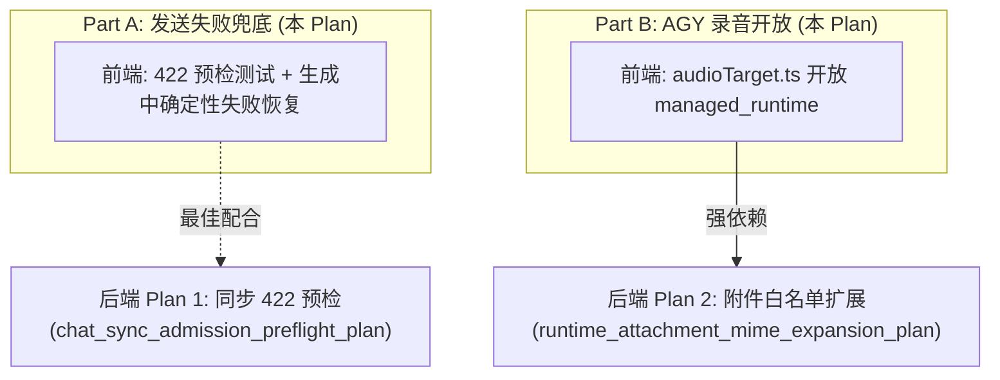

# V4 聊天发送失败兜底与 AGY 录音开放实施 Plan (R1 修订稿)

- 日期：2026-10-07
- 作者：Alaric（AGY CLI / Gemini 3.8 Flash）
- 审查：砚（claude-opus-5-5，pane 6）
- 状态：R1 修订稿（回应 pane 6 评审意见：3 处必改 + 4 处小改）
- 范围：`packages/app`（V4 前端）、`ReactSheet.md`（前端使用侧契约）
- 关联后端 Plan：
  - `ExoCore/Plan/chat_sync_admission_preflight_plan.md`（Solaire 施工中，同步 422 准入预检）
  - `ExoCore/Plan/runtime_attachment_mime_expansion_plan.md`（Solaire 施工中，AGY 附件白名单扩展与音频上传放开）
- 作废关联：`ExoCore-Desktop/Plan/chat_send_failure_recovery_plan.md`（已作废，原 Plan 误修 V3）

---

## 1. 事故背景与根因确认

### 1.1 事故还原
2026-10-06，Alicia 在手机 V4 界面对 AGY 会话 95 发送带 `txt` 附件的消息：
- 消息在界面一闪即逝；
- 没有任何错误横幅提示；
- 用户输入的文字与附件全部丢失；
- 后端数据库中没有任何该轮次的 user Message 记录。

### 1.2 根因分析（已对照 V4 源码实测确认）
1. **过早清空草稿与输入框**：
   - `useChatRuntime.ts:1797–1820`：POST 请求发出后，async 模式只要收到后端的 `ack`（`{ message_id, status: 'processing' }`），即判定为 `accepted` 并执行 `attemptDraftClear(convId)`；
   - `ChatComposer.tsx:268–274`：接收到 `accepted` 结果后，立即执行 `setText('')`、`saveConversationDraft(conversationId, '')` 与 `compose.clearCompose()`。此时真正的生成甚至还没在后端开始。
2. **生成中失败被 Reconcile 静默吞噬**：
   - 后端预检当时在 ack 之后的后台生成器中执行，失败时以轮询 `status: 'error'`（带 `{ code, message }`）返回；
   - `useChatRuntime.ts:894–897` 将错误仅挂载在乐观渲染的 `runtimeAssistant` 气泡上；
   - 随后 reconcile 启动，从服务端拉取消息列表覆盖视图。因为后端预检失败根本没有落库 user Message，乐观气泡与乐观 user 消息在对齐后全部被移除；
   - `releaseUi`（`:437`）执行时清空了 `transientError`，且将 `runtimeAssistant` 置为 `null`；
   - 结果：气泡消失、输入框已空、错误横幅未触发，整轮交互彻底蒸发。
3. **AGY 会话录音被误阻断**：
   - `packages/app/src/features/chat/audio/audioTarget.ts` 的 `resolveAudioTarget` 与 `resolveSelectedAudioTarget` 硬性检查 `endpoint.attachment_transports.includes('file_uri')`；
   - AGY 端点（id 7，`execution_type: 'managed_runtime'`）作为运行时端点，传输字段为空，因此被判定为 `endpoint_without_file_uri`，录音按钮被禁用；
   - 但事实上，AGY 的 Gemini 模型具备原生音频理解能力（已由 Alaric 用 `view_file` 实测验证 WebM 与 WAV 完全可读），录音产出的 `audio/webm` 应当被允许发送。

---

## 2. 核心目标与技术边界

### 2.1 目标
1. **确认并加固 HTTP 422 同步拒绝路径**：
   - 后端 Solaire 施工的同步准入预检将在 ack 前返回 `422 {code, message}`；
   - 验证 V4 现有的 `classifyRuntimeError` 将 4xx 归类为 `retryClass: 'safe'`，确保 `handleDispatchFailure` 早退并保留输入、草稿与附件，并在 `RuntimeStatusBanner` 呈现常驻横幅；补充完备测试。
2. **生成中确定性失败兜底（Deterministic In-generation Failure Recovery）**：
   - **严格限定终态范围（必改 1）**：仅在**确定性终态**（后端已明确终止本轮生成）下触发自动恢复：
     - Async 轮询：`status: 'error'`（后端显式返回生成错误并退出）；
     - SSE 流式：`event: 'error'`（后端流式显式抛出错误帧并终止）；
     - **非确定性状态保持 uncertain**：SSE `STREAM_INTERRUPTED`（EOF without terminal）与 async `status: 'not_found'` 保持现有 uncertain 阻塞语义（`blocked` 状态由用户手动确认，不自动回填输入框），防止后端仍在执行落库时前端重复发送制造重影。
   - **排除带录音轮次（必改 2）**：
     - 若发送包含录音（`hasRecordedAudio` / `audioRecovery.hasSnapshot()`），重试全权由 `audioRecovery` / `audioRecoveryMachine` 接管（`audioRecoveryBar` 交互）；
     - 兜底逻辑必须显式跳过录音轮次，避免文字双重恢复或与录音重试产生冲突。
   - **统一持久化落库判定（必改 3）**：
     - 复用既有 `AttemptPersistence` 类型模型（`exact_persisted` / `proven_absent` / `unknown`）作为唯一事实来源；
     - 结合 `clientTurnId` 精确比对当前轮次是否落库：
       - `proven_absent` 时：恢复输入文字（若有新文字则合并）、写回 `localStorage` 草稿、恢复已上传的 Compose 附件（去重合并）、在 `releaseUi` 之后注入 `transientError` 常驻横幅；
       - `exact_persisted` 时：维持现有语义不变（消息已在数据库中，不回填输入框，不清除历史）。
3. **AGY 会话开放录音按钮**：
   - `audioTarget.ts`：当端点 `execution_type === 'managed_runtime'` 时，跳过 `file_uri` 检查；模型自身仍必须拥有 `audio` 能力（`abilities.includes('audio')`）；非 `managed_runtime` 端点规则完全保持现状；
   - 不向后端伪造或登记假 `file_uri`；
   - 明确解耦部署顺序：失败兜底可独立上线，录音按钮依赖后端白名单放开。

### 2.2 不改动边界
- 不改动后端 Django 代码与 Extension 代码（跨仓隔离）；
- 不改动 V3 `packages/chat-core`（本期锁定 V4）；
- 不修改底层的 `V4RuntimeLease` 存储结构与锁状态机；
- 录音核心生命周期（`useAudioRecorder`）保持不变。

---

## 3. 详细设计与改动方案

### 3.1 确认 HTTP 422 安全拒绝路径（现有着陆点验证）
- **链路机理**：
  1. `postChatAsync` / `fetchChatSSEStream` 收到 HTTP 422 时，`res.ok` 为 `false`，抛出 `AppApiError`，携带 `status: 422` 及 body 中的 `{ code, message }`；
  2. `classifyRuntimeError(dispatchErr, 'uncertain')`：检测到 `status >= 400 && status < 500` 且非 `ambiguousWrite`，将其精确归类为 `retryClass: 'safe'`，并提取后端的 `code` 与 `message`；
  3. `handleDispatchFailure`：当 `classified.retryClass === 'safe'` 时，执行 `clearRuntimeLease`，在 `releaseUi` 之后调用 `setTransientError(classified)`，并返回 `'rejected'`；
  4. `ChatComposer.handleSubmit`：由于返回值为 `'rejected'`，不满足 `outcome === 'accepted'`，**不会调用 `setText('')`、`saveConversationDraft('')` 或 `compose.clearCompose()`**；
  5. `ConversationPage`：`RuntimeStatusBanner` 接收到 `runtimeError`，直接展示错误文案。
- **结论**：后端同步 422 改造落地后，V4 前端现有路径天然支持安全拒绝。本 Plan 将补充端到端单元测试予以固化。

### 3.2 附件恢复与去重（`useComposeAttachments.ts`）（小改 5）
- **接口扩展**：
  在 `ComposeAttachmentApi` 中新增 `restoreEntries(entries: ComposeAttachmentEntry[]) => void`；
- **实现逻辑与去重（小改 5）**：
  - 提取传入条目中已成功上传且持有有效 `attachmentId` 的项；
  - **按 `attachmentId` 去重合并**：比对当前已有 `entries` 的 `attachmentId`，若当前已存在相同 `attachmentId` 则跳过，防止用户在等待期间手动重复添加导致条目重复；
  - 为每个新恢复的条目重新分配 `clientId: nextClientId++`；
  - 重新绑定预览：通过 `imagePreviewFor(entry.file)` 为图片生成新的可用 ObjectURL（防止先前被 revoke 的 URL 导致碎图）；
  - 追加合并至当前 `entries`，确保 `getSuccessfulIds()` 能够立即读出这批已就绪的附件。

### 3.3 运行时生成中失败判定与统一持久化裁决（`useChatRuntime.ts`）（必改 1、2、3，小改 4）
- **在途轮次上下文追踪**：
  - 新增 `inFlightTurnRef = useRef<{ epoch: number; conversationId: number; clientTurnId?: string; content: string; pendingAttachments: number[]; isAudioTurn: boolean } | null>(null)`；
  - 在 `executeTurn` 发送（`operation === 'send'`）时，记录当前轮次信息，并明确标记 `isAudioTurn = Boolean(turn.attemptKey)`。
- **统一持久化落库判定（必改 3）**：
  - 保持 `AttemptPersistence`（`exact_persisted` / `proven_absent` / `unknown`）为全系统唯一持久化事实标准；
  - 在 `runReconcileStages` 获取到最新消息窗口 `page = await fetchFreshWindow(convId)` 后：
    - 对于带 `clientTurnId` 的普通发送轮次：
      - 若 `page.messages.some(m => m.role === 'user' && m.clientTurnId === inFlightTurnRef.current?.clientTurnId)`，判定为 `exact_persisted`；
      - 若最新权威窗口中无该 `clientTurnId`，且当前处于确定性终态（`status === 'error'` 或 `event: 'error'`），判定为 `proven_absent`；
      - 若属于非确定性中断（`not_found` / `STREAM_INTERRUPTED`），保持 `unknown`，不判定为 `proven_absent`；
- **确定性失败恢复执行条件（必改 1、2、3，小改 4）**：
  - **触发条件**：
    1. 终态属于确定性失败：`ctx.outcome === 'error'`（排除 `not_found` 与中断）；
    2. 持久化裁决为 `proven_absent`（服务端无任何该轮 user 消息落库）；
    3. 非录音轮次：`!inFlightTurnRef.current?.isAudioTurn`（录音轮次全权由 `audioRecovery` 状态机接管，必改 2）；
  - **恢复动作与时序保证（小改 4）**：
    1. **写回草稿**：调用 `saveConversationDraft(convId, inFlightTurnRef.current.content)`；
    2. **通知恢复**：派发 `restoredTurn: { token: number; conversationId: number; text: string; attachmentIds: number[] } | null`；
    3. **横幅注入时序**：在 `runReconcileStages` 的 `clearOut.state === 'cleared'` 分支中，**必须在 `releaseUi(identity)` 执行完成之后**，调用 `setTransientError({ ...errorPayload, retryClass: 'safe' })`，确保常驻错误横幅不会被 `releaseUi` 清空；
- **已有 user 行落库时的现有语义维持**：
  - 若持久化判定为 `exact_persisted`：
    - 绝不触发 `restoredTurn`，不重写草稿；
    - 错误按既有行为挂载在气泡上，历史保持完整。

### 3.4 Composer 输入与附件恢复响应（`ChatComposer.tsx`）
- **在途快照暂存**：
  - 在 `handleSubmit` 提交普通发送（非录音）时，记录提交快照：
    `stashedSubmissionRef.current = { conversationId, text: submittedText, entries: compose.entries.filter(e => e.status === 'success') }`；
- **响应恢复通知**：
  - 监听 `restoredTurn`：
    - 若 `restoredTurn.conversationId === conversationId`（未切换会话）：
      - **文字恢复**：若当前输入框为空，恢复为 `restoredTurn.text`；若用户已输入新文字，则合并为 `${restoredTurn.text}\n\n${currentText}`；
      - **草稿同步**：调用 `saveConversationDraft(conversationId, restoredText)`；
      - **附件恢复**：从 `stashedSubmissionRef.current` 中提取 entries，调用 `compose.restoreEntries(entries)`；
    - 若 `restoredTurn.conversationId !== conversationId`（已切换会话）：
      - 原会话的草稿已由 runtime 写入 `localStorage`；
      - 当前会话的输入框与附件**不做任何篡改**；
    - 清空 `stashedSubmissionRef.current`。

### 3.5 AGY 录音开放（`audioTarget.ts`）
- **目标解析调整**：
  - `resolveAudioTarget`：
    ```typescript
    const requiresFileUri = endpoint?.execution_type !== 'managed_runtime';
    if (!endpoint || (requiresFileUri && !(endpoint.attachment_transports ?? []).includes('file_uri'))) {
      return { gate: { state: 'unsupported', reason: 'endpoint_without_file_uri' }, target: null, reason: 'endpoint_without_file_uri' };
    }
    ```
  - `resolveSelectedAudioTarget`：
    ```typescript
    const requiresFileUri = endpoint.execution_type !== 'managed_runtime';
    if (requiresFileUri && !(endpoint.attachment_transports ?? []).includes('file_uri')) {
      return { state: 'unsupported', reason: 'endpoint_without_file_uri' };
    }
    ```
  - **模型能力强校验保留**：`!(model.abilities ?? []).includes('audio')` 校验依旧在端点判断之前执行，不支持音频的模型（如纯文本模型）依然精准返回 `model_without_audio`。

---

## 4. 依赖关系与上线顺序（解耦调整，小改 7）

本方案包含两个功能点，它们具备不同的依赖解耦关系：



1. **Part A（发送失败兜底）可立即独立上线**：
   - 不强依赖后端 Plan 1 即可工作：若后端未上线 Plan 1，后台生成器报错（async `status: 'error'`）同样会被兜底机制捕获并安全恢复草稿；若后端已上线 Plan 1，则同步 422 提前接住；
   - 上线后即可立即止血用户丢字问题。
2. **Part B（AGY 录音开放）依赖后端 Plan 2**：
   - 依赖 Solaire 的第二份 Plan（`runtime_attachment_mime_expansion_plan.md`）部署至 ExoCore 与 Runtime（放开 `audio/webm` 上传入口与白名单）；
   - 若 Part B 随 Part A 提前上线：AGY 录音按钮虽然点亮，但在 Plan 2 上线前点击发送，音频上传会被后端拒绝，但文字与录音快照受保，不会丢失。

---

## 5. 前端契约说明（`ReactSheet.md`）（小改 6）

后端接口内部变更由 Solaire 的后端 Plan 维护。前端 Plan 仅在 `ReactSheet.md` 记录前端消费侧的行为预期：
1. **§1.3 音频上传（前端预期）**：
   - 补充说明：前端 V4 对 `execution_type === 'managed_runtime'` 的端点不再因缺少 `file_uri` 而前端禁用录音，录音文件统一按 `audio/webm` 上传。
2. **§1.4 聊天请求（前端预期）**：
   - 补充说明：前端 V4 将 HTTP 422 视为安全输入拒绝（`retryClass: 'safe'`），直接保留用户输入框内容与附件。

---

## 6. 消融实验与奥卡姆剃刀自检 (Ablation & Razor)

| 潜在设计 | 审视与裁决 | 裁决理由 |
|---|---|---|
| 为 `ModelCatalog` 端点伪造 `file_uri` 传输字段 | **坚决否决** | 破坏单一样本真实性；Managed Runtime 本质非直接调用 Google Cloud Storage，不应混淆概念。 |
| 在非确定性中断（STREAM_INTERRUPTED / not_found）时自动恢复 | **坚决否决（必改 1）** | 非确定性状态下后端可能仍在异步写入 user 行，此时恢复输入框会导致用户重复点击发送，制造重影消息。 |
| 兜底恢复同时接管录音轮次 | **坚决否决（必改 2）** | 录音轮次已有 `audioRecovery` 状态机与独立 UI 条（`audioRecoveryBar`），双重恢复会导致冲突与重试混乱。 |
| 在 Reconcile 外另起一套持久化判定逻辑 | **坚决否决（必改 3）** | 复用现有的 `AttemptPersistence` 标准，避免系统内出现两套相互矛盾的事实判断。 |

---

## 7. 验证目标与测试规范 (Verification Targets)

遵循行为守则：**不将测试源码堆砌于 Plan 中，仅冻结验证目标与断言接口**。

### 7.1 单元测试（Vitest）

#### A. 目标解析守卫测试 (`packages/app/src/test/p1c_audio_target.test.ts`)
1. **Managed Runtime 端点录音支持**：
   - 输入：端点 `execution_type === 'managed_runtime'`，`attachment_transports: []`，模型具有 `abilities: ['audio']`；
   - 断言：`resolveAudioTarget` 与 `resolveSelectedAudioTarget` 均返回 `gate.state === 'supported'`。
2. **Managed Runtime 无音频能力模型拦截**：
   - 输入：端点 `execution_type === 'managed_runtime'`，模型 `abilities: []`；
   - 断言：返回 `gate.state === 'unsupported'`，`reason === 'model_without_audio'`。
3. **传统端点（cloud/direct_api）保持原有 `file_uri` 校验**：
   - 输入：端点 `execution_type === 'cloud'`，`attachment_transports: []`；
   - 断言：返回 `gate.state === 'unsupported'`，`reason === 'endpoint_without_file_uri'`。

#### B. 运行时客户端与错误分类测试 (`packages/app/src/test/runtime_client.test.ts`)
1. **同步 HTTP 422 预检拒绝分类**：
   - 输入：`AppApiError` 携带 `status: 422`，body `{ code: 'runtime_attachment_type_unsupported', message: '...' }`；
   - 断言：`classifyRuntimeError` 输出 `retryClass === 'safe'`，`code === 'runtime_attachment_type_unsupported'`。

#### C. 生成中失败兜底集成测试 (`packages/app/src/test/v4_send_failure_recovery.test.tsx` 新建)
1. **同步 422 预检拒绝流程**：
   - 场景：用户输入文字与附件点击发送，POST 同步返回 422；
   - 断言：`sendMessage` 返回 `'rejected'`；Composer 文字与附件未清空；`RuntimeStatusBanner` 呈现 422 错误文案。
2. **Async 模式确定性失败且未落库 user 行（事故核心场景，小改 7）**：
   - 场景：POST 成功返回 ack，Composer 乐观清空并暂存；随后轮询第 1 帧返回生成期错误 `status: 'error', error_message: { code: 'project_rules_unreadable', message: '规则文件读取失败' }`；Reconcile 消息窗口无当前 `clientTurnId`；
   - 断言：
     - `runtimeError` 常驻并呈现于 `RuntimeStatusBanner`（`transientError` 在 `releaseUi` 之后正确保留，小改 4）；
     - Composer 文字恢复为发送前的文字；
     - 当前会话的 localStorage 草稿恢复；
     - Compose 附件列表恢复，且包含原有 `attachmentId`；
     - 乐观气泡与乐观 user 消息随 Reconcile 撤下，不留幽灵消息。
3. **Async 模式失败但已落库 user 行（维持现有语义）**：
   - 场景：POST ack 成功，生成中途报错，但 Reconcile 发现该轮 user 消息已成功保存入库；
   - 断言：历史消息列表中保留该 user 消息；Composer 文字**不予回填**；不重复写入草稿。
4. **生成中失败时用户已有新输入**：
   - 场景：发送后在生成期间，用户在输入框打入了 `"补充说明"`；随后生成失败；
   - 断言：输入框文字合并为 `"原文字\n\n补充说明"`，两者皆不丢失。
5. **生成中失败时用户已切换会话**：
   - 场景：在会话 A 发送，生成期间切换至会话 B；会话 A 生成失败；
   - 断言：会话 B 的输入框不受污染；会话 A 的 localStorage 草稿被安全写入原发送文字。
6. **非确定性中断（STREAM_INTERRUPTED）保持 uncertain 且不恢复（必改 1）**：
   - 场景：SSE 连接在输出任何 user/assistant 内容前异常中断（EOF without terminal）；
   - 断言：运行时进入 `blocked` uncertain 态，**不自动恢复**文字至 Composer，避免并发重复发送。
7. **录音轮次失败排除（必改 2）**：
   - 场景：带录音的发送在生成期失败；
   - 断言：文字不走普通 Composer 恢复，交由 `audioRecovery` / `audioRecoveryBar` 处理，不产生冲突。
8. **附件恢复去重合并（小改 5）**：
   - 场景：发送包含附件 101 的消息，失败前用户又添加了附件 102；
   - 断言：恢复后 Compose 列表包含 101 与 102，不覆盖且不产生重复条目。

### 7.2 回归验证门禁
- `pnpm --filter app test`：全量前端单元测试通过；
- `pnpm --filter app build`：TypeScript 类型检查与构建 0 错误；
- `pnpm lint`：代码风格符合标准。

---

**署名：** Alaric（AGY CLI / Gemini 3.8 Flash）— 2026-10-07
